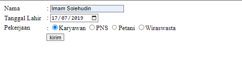
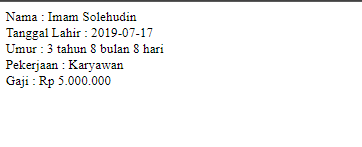
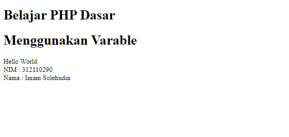
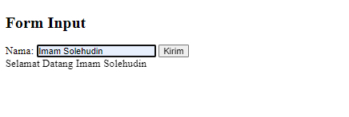
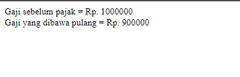
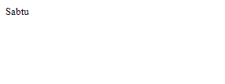
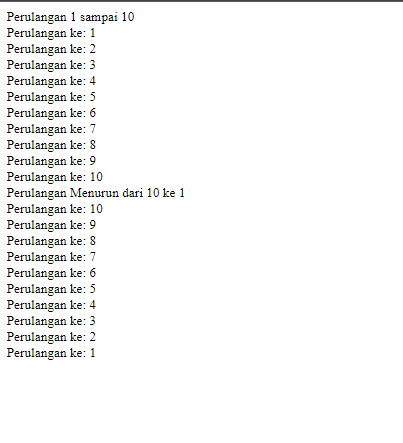
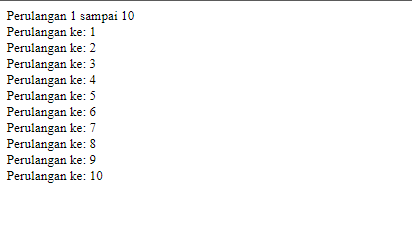
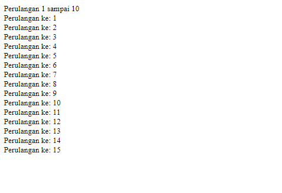

# Latihan-Praktikum-2

## Nama    : Imam Solehudin
## Nim     : 312110290
## Kelas   : TI.21.C.1
## Matkul  : Pemrograman Web 2

- Program 

1. Index.php

```php

<!DOCTYPE html>
<html lang="en">
<head>
<title>Tugas</title>
</head>
<body>
<form action="output.php" method="post">
<table>
    <tr>
        <td width="100"> Nama  </td>
        <td> : <input type="text" name="nama" /> </td> 
    </tr>
        
    <tr>
        <td>Tanggal Lahir  </td>
        <td> : <input type="date" name="tanggal_lahir"> </td> </tr>
        
    <tr> 
        <td> Pekerjaan  </td>
       <td> : <input type="radio" name="pekerjaan" value="Karyawan"/>Karyawan
        <input type="radio" name="pekerjaan" value="PNS"/>PNS
        <input type="radio" name="pekerjaan" value="Petani"/>Petani
        <input type="radio" name="pekerjaan" value="Wiraswasta"/>Wiraswasta </td>
    </tr>
    <tr>
        <td></td>
        <td> <input type="submit" value="kirim"/> </td>
    </tr>
</table>
</form>
</body>
</html>
```


2. output.php

```php
<title> Output </title>
<?php
    
    $tanggal_lahir = new DateTime($_POST['tanggal_lahir']);
    $sekarang = new DateTime("today");
    if ($tanggal_lahir > $sekarang) { 
    $thn = "0";
    $bln = "0";
    $tgl = "0";
    }
    $thn = $sekarang->diff($tanggal_lahir)->y;
    $bln = $sekarang->diff($tanggal_lahir)->m;
    $tgl = $sekarang->diff($tanggal_lahir)->d;

    echo 'Nama      :  ' . $_POST['nama'];
    echo "<br>";
    echo "Tanggal Lahir : ". $_POST['tanggal_lahir'];
    echo "<br>";
    echo "Umur      : ";
    echo $thn." tahun ". $bln. " bulan " . $tgl. " hari";
    echo "<br>";
    echo "Pekerjaan     : " . $_POST['pekerjaan'];
    echo "<br>";


    $pekerjaan = ($_POST['pekerjaan']);
    switch ($pekerjaan){
        case "Karyawan": echo "Gaji     : Rp 5.000.000";break;
        case "PNS": echo "Gaji      : Rp 6.000.000";break;
        case "Petani": echo "Gaji       : Rp 3.000.000";break;
        case "Wiraswasta": echo "Gaji       : Rp 4.000.000";break;
    }
?>
```


3. php dasar


```php
<!DOCTYPE html>
<html lang="en">
<head>
 <meta charset="UTF-8">
 <title>PHP Dasar</title>
</head>
<body>
 <h1>Belajar PHP Dasar</h1>
 <?php
 echo "Hello World";
 ?>
</body>
</html>
```


4. variable_php.php

```php
<!DOCTYPE  html>
<html lang="en">
<head>
    <meta charset="UTF-8">
    <title>PHP Dasar </title>
<head>
<body>
    <h1> Belajar PHP Dasar </h1>
    <h1> Menggunakan Varable </h1>
<?php
    echo "Hello World" ;
    echo "<br>";
    $nim = "312110290";
    $nama = 'Imam Solehudin';
    echo "NIM   : ". $nim . "<br>";
    echo "Nama  : " . $nama;
?>
</body>
</html>
```


5. Predifine_variable.php
Untuk bisa mengakses file ini kita link localhost nya harus kita tambah (?nama='objek'). contohnya :
http://localhost/lab2_php_dasar/latihan/Predefine_varible.php?nama=Imam
```php
<?php
echo 'Selamat Datang ' . $_GET['nama'];
?>
```


6. form_input.php

```php
<!DOCTYPE html>
<html lang="en">
<head>
 <meta charset="UTF-8">
 <title>PHP Dasar</title>
</head>
<body>
<h2>Form Input</h2>
<form method="post">
 <label>Nama: </label>
 <input type="text" name="nama">
 <input type="submit" value="Kirim">
</form>
<?php
echo 'Selamat Datang ' . $_POST['nama'];
?>
</body>
</html>
```


7. Operator.php

```php
<?php
$gaji = 1000000;
$pajak = 0.1;
$thp = $gaji - ($gaji*$pajak);
echo "Gaji sebelum pajak = Rp. $gaji <br>";
echo "Gaji yang dibawa pulang = Rp. $thp";
?>
```


8. kondisi_if.php

```php
<?php
$nama_hari = date("l");
if ($nama_hari == "Sunday") {
    echo "Minggu";
} elseif ($nama_hari == "Monday") {
    echo "Senin";
} else {
    echo "Selasa"; }
?>
```


9. kondisi_switch.php

```php
<?php
$nama_hari = date("l");
switch ($nama_hari) {
    case "Sunday":
        echo "Minggu";
        break;
    case "Monday":
        echo "Senin";
        break;
    case "Tuesday":
        echo "Selasa";
        break;
    default:
        echo "Sabtu";
     }
?>
```


10. for.php

```php
<?php
echo "Perulangan 1 sampai 10 <br />";
for ($i=1; $i<=10; $i++) {
   echo "Perulangan ke: " . $i . '<br />'; 
}

echo "Perulangan Menurun dari 10 ke 1 <br />";
for ($i=10; $i>=1; $i--) {
   echo "Perulangan ke: " . $i . '<br />'; 
}
?>
```


11. while.php

```php
<?php
echo "Perulangan 1 sampai 10 <br />";
$i=1;
while ($i<=10) {
    echo "Perulangan ke: " . $i . '<br />';
    $i++;
}
?>
```


12. dowhile.php


```php
<?php
echo "Perulangan 1 sampai 10 <br />";
$i=1;
do {
echo "Perulangan ke: " . $i . '<br />';
$i++;
} while ($i<=15);
?>
```

